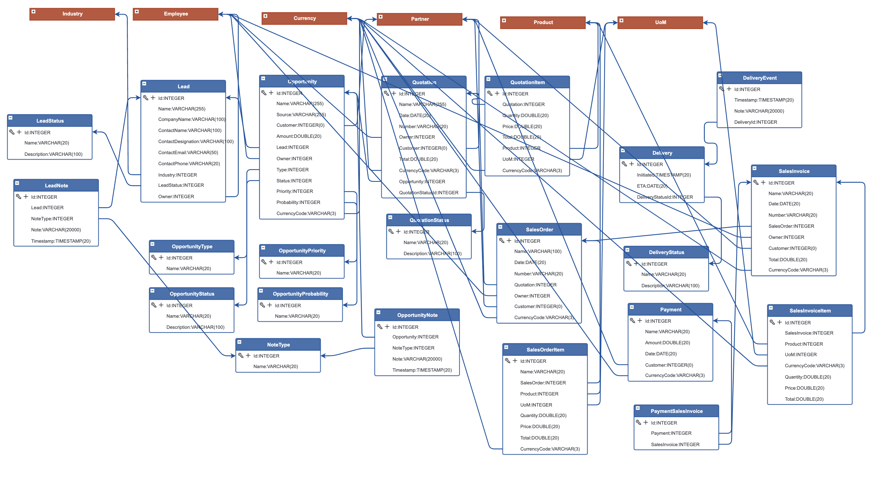

# codbex-hermes

Customer Relationship Management

## Model

## Application

## Build

	docker build -t codbex-hermes:1.0.0 .

## Run

	docker run --name codbex-hermes -d -p 8080:8080 codbex-hermes:1.0.0

## Clean

	docker rm codbex-hermes

 ### Application

#### Launchpad

#### Management

